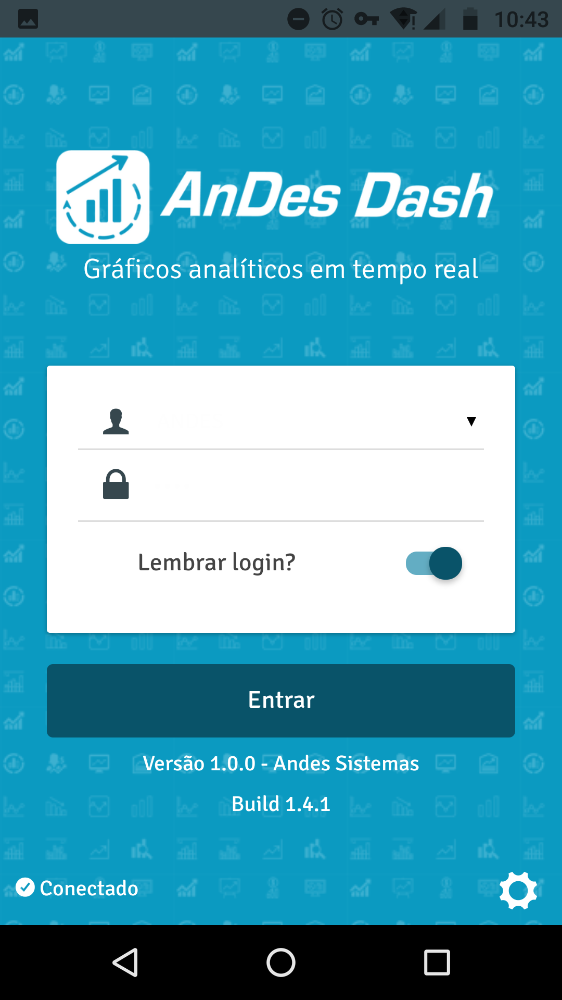
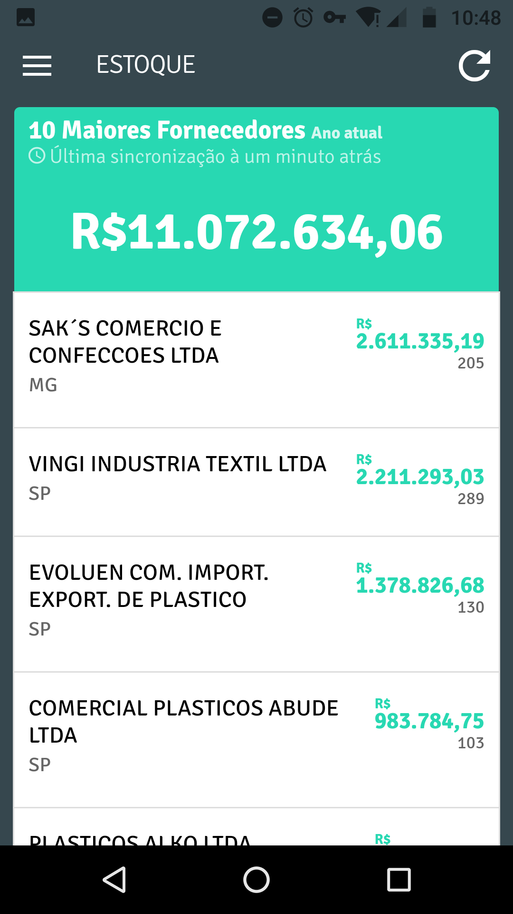

.. _h7277751e5949698124078521b51232b:

AndesDash
#########

Tutorial

.. _hd6b74e79614413416737285b6d5840:

Instalação APK (somente Android versão acima da 4.2)
****************************************************

Com o link disponibilizado pela Andes Sistemas acessar o navegador do celular e baixar o arquivo com extensão .apk

+----------+----------+----------+----------+
|\ |IMG1|\ |\ |IMG2|\ |\ |IMG3|\ |\ |IMG4|\ |
+----------+----------+----------+----------+

Após baixar o arquivo clique sobre ele:

+----------+
|\ |IMG5|\ |
+----------+

Ao abrir a seguinte tela clique em instalar:

+----------+
|\ |IMG6|\ |
+----------+

Após instalar clique em Abrir:

+----------+
|\ |IMG7|\ |
+----------+

Pronto o App AnDesDash foi instalado no seu smartphone, agora devemos configurar sua empresa para que comece a sincronizar com o banco de dados e consiga visualizar os gráficos sobre a empresa. Inicialmente ele vem com dados para demonstração, devemos configurar o acesso a empresa conforme orientações a seguir.

.. _h6f1c13c60f29422410366e72406047:

Configurar Empresa
******************

Com o App AnDesDash aberto faça o seguinte:

Clique sobre o Menu , depois na opção configurar empresa.

+----------+----------+
|\ |IMG8|\ |\ |IMG9|\ |
+----------+----------+

Irá aparecer a tela para configurar a chave de ativação que assim será feito a sincronização com o banco de dados da empresa.

+-----------+-----------+
|\ |IMG10|\ |\ |IMG11|\ |
+-----------+-----------+

Com a chave de ativação fornecida pelas Andes Sistemas digite ela no campo destacado conforme figura ao acima e clique sobre ativar dispositivo.

\ |STYLE0|\ 

A cobrança do serviço é por dispositivo, se configurar em outros dispositivos haverá cobrança adicional.

.. _h403a5e5b3f5c114446d5f3338373555:

Acessando o App AnDesDash
*************************

Feito a ativação a tela inicial ficará assim:

+-----------+
|\ |IMG12|\ |
+-----------+

Agora o usuário deve acessar com o mesmo usuário e senha do Andes ERP para ter acesso aos gráficos em tempo real.

Clique sobre o usuário e selecione o mesmo, você pode marcar a opção Lembrar  login , para deixar padrão, lembrando que o acesso a determinados gráficos pode ser limitado dependendo o nível de acesso que possui no ERP.

+-----------+-----------+
|\ |IMG13|\ |\ |IMG14|\ |
+-----------+-----------+

Ao acessar o App AnDesDash após informar o usuário e senha temos a seguinte exibição:

+-----------+-----------+
|\ |IMG15|\ |\ |IMG16|\ |
+-----------+-----------+

No Menu ao lado superior esquerdo é possível selecionar outras visões , por padrão a primeira a carregar é o faturamento

+-----------+-----------+-----------+
|\ |IMG17|\ |\ |IMG18|\ |\ |IMG19|\ |
+-----------+-----------+-----------+

Podemos gerar várias visões conforme a demanda do cliente, mas por padrão vem XX visões , conforme a necessidade do cliente e mediante orçamento podemos desenvolver outras visões tendo um custo acessível ao mesmo.

+-----------+-----------+-----------+-----------+
|\ |IMG20|\ |\ |IMG21|\ |\ |IMG22|\ |\ |IMG23|\ |
+-----------+-----------+-----------+-----------+
|\ |IMG24|\ |\ |IMG25|\ |\ |IMG26|\ |\ |IMG27|\ |
+-----------+-----------+-----------+-----------+

.. _h3245336071222a4a172b561043667f:

Como é feita a sincronização do App AnDesDash com o AndesERP:
*************************************************************

+-----------+
|\ |IMG28|\ |
+-----------+

.. bottom of content

.. |STYLE0| replace:: **Importante**

.. |IMG18| image:: static/AndesDash_Cliente_17.png
   :height: 257 px
   :width: 144 px

